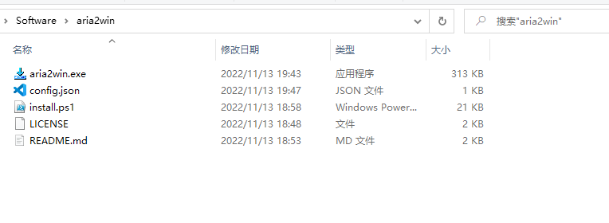
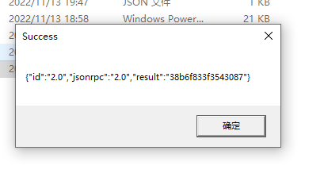
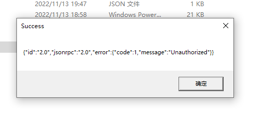

# Aria2win 极简aria2 windows客户端

极简的aria2 windows客户端(exe大小为几百KB, 无后台进程)

可关联.torrent等文件, 实现打开文件/命令行输入链接地址后自动触发下载

使用config.json配置aria2c jsonrpc, 支持远程下载


## 使用方式

### 下载
从[release页面](https://github.com/AutumnSun1996/aria2win/releases)下载zip文件, 解压到任意文件夹

压缩包中包含如下文件:



### 安装

右键单击`install.ps1`, 选择`使用Powershell运行`(或进行[手动配置](#手动配置))

PS: `install.ps1`脚本将自动绑定`.torrent`, `.meta4`后缀名的文件, 并将当前文件夹添加到`PATH`环境变量

### RPC配置

根据aria2c服务配置, 修改`config.json`中的配置.

```json
{
  "rpc_url": "http://localhost:6800/jsonrpc",
  "rpc_token": "",
  "rpc_id": "aria2win",
  "timeout": 10
}
```

其中`timeout`为请求jsonrpc的超时时间, 单位为s.

**注意**: 该文件必须为合法的json格式, 否则会回退到默认配置.


### 调用

直接双击`.torrent`/`.meta4`后缀名的文件即可

若任务提交成功, 将会出现如下的信息框:




## 其他说明

### 常见错误和处理方式



若出现如上的错误信息, 说明任务提交失败. 此时应根据错误信息, 检查`config.json`中的RPC配置是否正确, aria2c是否正常运行等.

若文件被其他程序打开, 未出现信息框, 可能是安装失败, 请查看[安装](#安装) 或 [手动配置](#手动配置).

### 命令行调用

```cmd
aria2win.exe TARGET
```
`TARGET`可为本地种子文件地址/下载链接/magnet链接


### 手动配置

`install.ps1`脚本将自动绑定`.torrent`, `.meta4`后缀名的文件, 并将当前文件夹添加到`PATH`环境变量

执行失败时, 可以进行手动配置:

1. 文件关联:
   
    配置后可以支持打开`.torrent`, `.meta4`文件时自动触发下载.

    配置方式: 右键点击目标文件->打开方式->选择其他应用->更多应用->查找其他应用->选择aria2win.exe

2. 修改PATH(将`aria2win.exe`所在文件夹添加到`PATH`环境变量):

    配置后可以在任意文件夹使用 `aria2win.exe TARGET` 命令触发下载
   
    配置方式: 参考 [Google](https://www.google.com.hk/search?q=windows+%E6%B7%BB%E5%8A%A0PATH) / [百度](https://www.baidu.com/s?ie=utf-8&wd=windows%20%E6%B7%BB%E5%8A%A0PATH)
